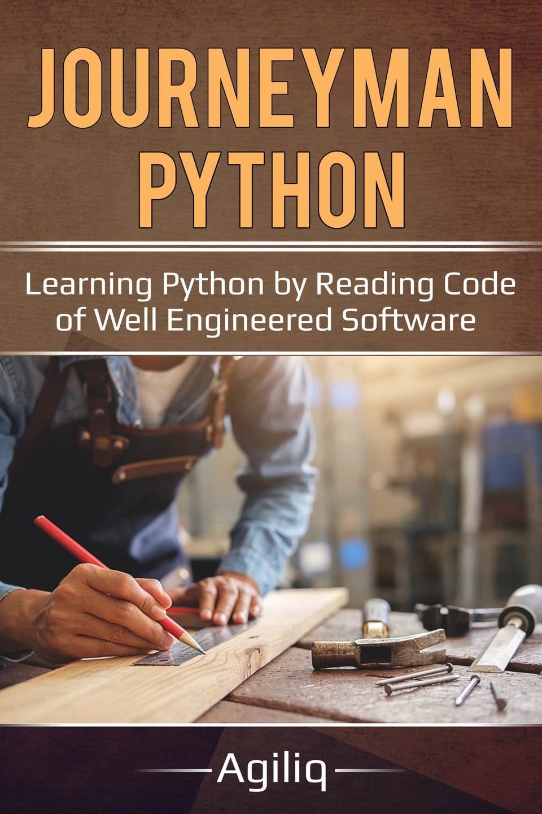

Journeyman Python:
==========================================================================================

Learning Python by reading code of well engineered software
+++++++++++++++++++++++++++++++++++++++++++++++++++++++++++++

The best way to learn any programing language and technique is to read other people's code.
What better way to learn that read through the code of some of the most well engineered open source Python libraries. In this book, we will read through selected code from Django, Flask and Pandas.

We will learn topics such as decorators, context managers, generators, iterators, itertool, and common design patterns used by Django, Flask and Pandas.

.. toctree::
   :maxdepth: 2
   :caption: Chapters:

   first-class-functions
   iterators-slicing-and-generators
   decorators
   magic-methods
   context-managers

Indices and tables
==================

* :ref:`genindex`
* :ref:`modindex`
* :ref:`search`
